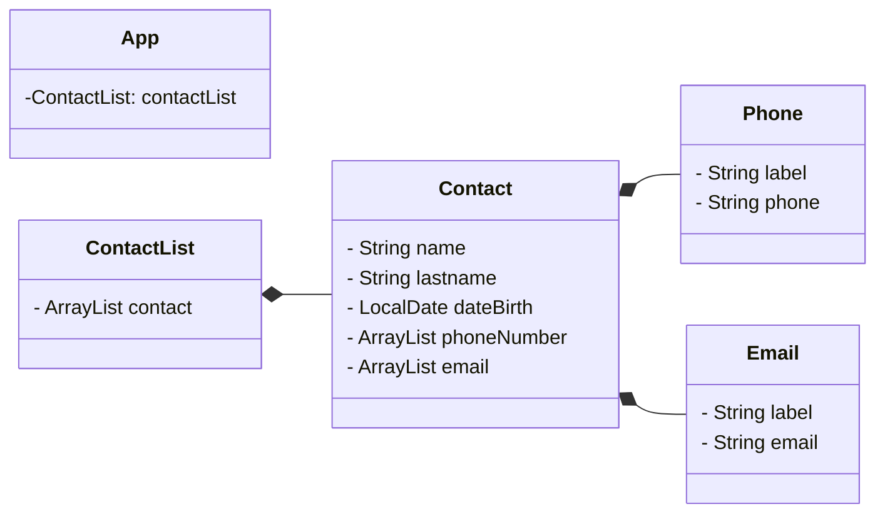

# Diagrama de classes UML

```mermaid
classDiagram
    
        direction LR
        
        class App {
            -ContactList: contactList
        }
        
        class ContactList {
            - ArrayList<Contact> contact
        }
        
        class Contact {
            - String name
            - String lastname
            - LocalDate dateBirth
            - ArrayList<Phone> phoneNumber
            - ArrayList<Email> email
        }
        
        class Phone {
            - String label
            - String phone
        }

        class Email {
            - String label
            - String email
            
        }

    ContactList *-- Contact
    Contact *-- Phone
    Contact *-- Email
```