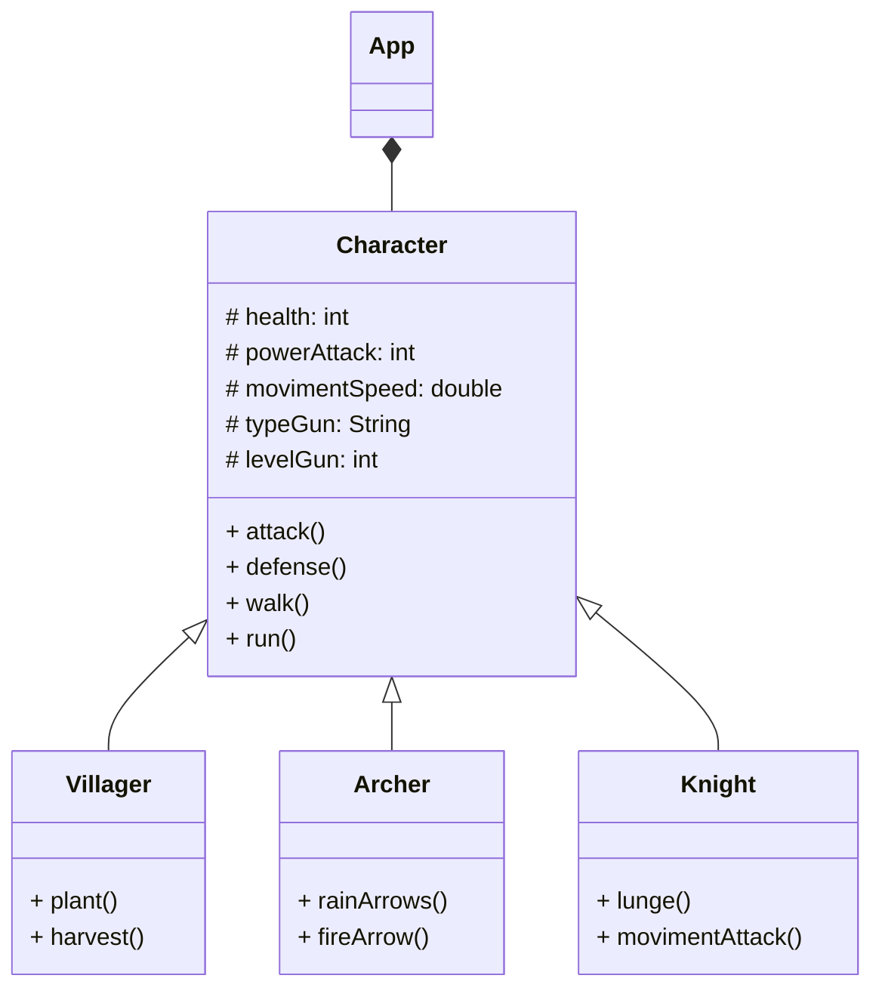

```mermaid
    classDiagram
    
        class App {
            
        } 
        
        class Character {
            # health: int
            # powerAttack: int
            # movimentSpeed: double
            # typeGun: String
            # levelGun: int
            
            + attack()
            + defense()
            + walk()
            + run()
        }
        
        class Villager {            
            + plant()
            + harvest()
        }
        
        class Archer {
            + rainArrows()
            + fireArrow()
        }
        
        class Knight {
            + lunge()
            + movimentAttack()
        }

        App *-- Character

        Character <|-- Villager
        Character <|-- Archer
        Character <|-- Knight
```