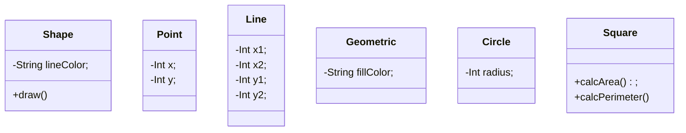

```mermaid

    classDiagram

        class Shape{
            -String lineColor;
            +draw()
        }
        
        class Point {
            -Int x;
            -Int y;
        }
        
        class Line {
            -Int x1;
            -Int x2;
            -Int y1;
            -Int y2;
        }
        
        class Geometric {
            -String fillColor;
        }
        
        class Circle {
            -Int radius;
        }
        
        class Square {
            +calcArea();
            +calcPerimeter()
        }

```