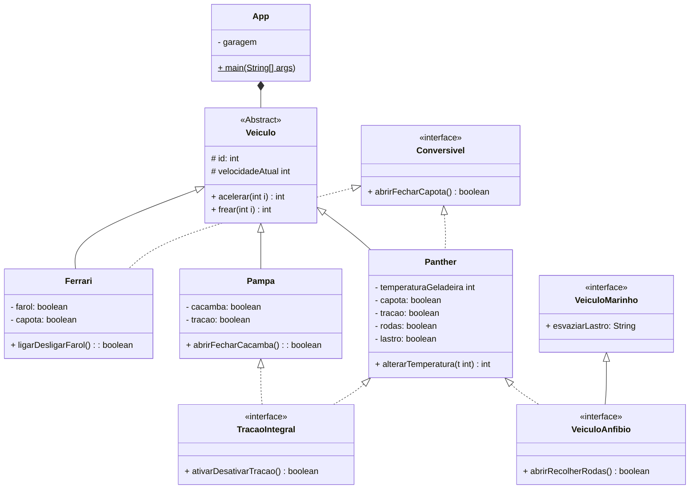

```mermaid
    classDiagram
        class App {
            - garagem
            + main(String[] args)$
        }

        App  *-- Veiculo
        
        class Veiculo {
            <<Abstract>>
            # id: int
            # velocidadeAtual int 
            
            + acelerar(int i) int
            + frear(int i) int
        }

        class Ferrari {
            - farol: boolean
            - capota: boolean
            + ligarDesligarFarol(): boolean
        }

        class Pampa {
            - cacamba: boolean
            - tracao: boolean
            + abrirFecharCacamba(): boolean
        }
    
        class Panther {
            - temperaturaGeladeira int
            - capota: boolean
            - tracao: boolean
            - rodas: boolean
            - lastro: boolean
            + alterarTemperatura (t int) int
        }

        Veiculo <|-- Ferrari
        Veiculo <|-- Panther
        Veiculo <|-- Pampa
        
        class Conversivel {
            <<interface>>
            + abrirFecharCapota() boolean
        }

        Conversivel <|..  Panther
        Conversivel <|.. Ferrari
        
        class TracaoIntegral {
            <<interface>>
            + ativarDesativarTracao() boolean
        }

        Pampa <|..  TracaoIntegral
        Panther <|.. TracaoIntegral

        class VeiculoAnfibio {
            <<interface>>
            + abrirRecolherRodas() boolean
        }

        Panther <|.. VeiculoAnfibio

        class VeiculoMarinho {
            <<interface>>
            + esvaziarLastro: String
        }

        VeiculoMarinho <|--   VeiculoAnfibio
        
        
        
```